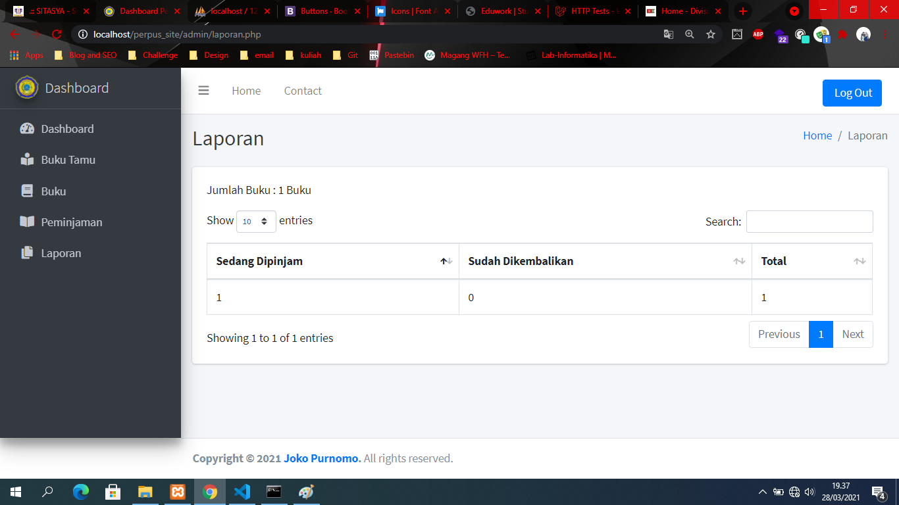

Website Perpustakaan Sekolah Untuk Uji Kompetensi

Dibuat dengan :
<ul type="1">
    <li>PHP Native V7</li>
    <li>Bootstrap V4</li>
    <li>Template AdminLTE V3</li>
    <li>Database MySQL</li>
</ul>

Cara menyambungkan database :
<ul type="1">
    <li>Buat database dengan nama perpus</li>
    <li>Import Database perpus_site.sql ke database yang sudah di buat di PHPMyAdmin</li>
    <li>Buka Web menggunakan Xampp Versi baru</li>
    <li>Login ke dashboard admin.</li>
</ul>

Login Admin  
Username : arifdwi
Password : admin

Login Admin Page :

Dashboard Page :

Buku Tamu Page :

Buku Page :

Peminjaman Page :

Laporan :

Terima Kasih.